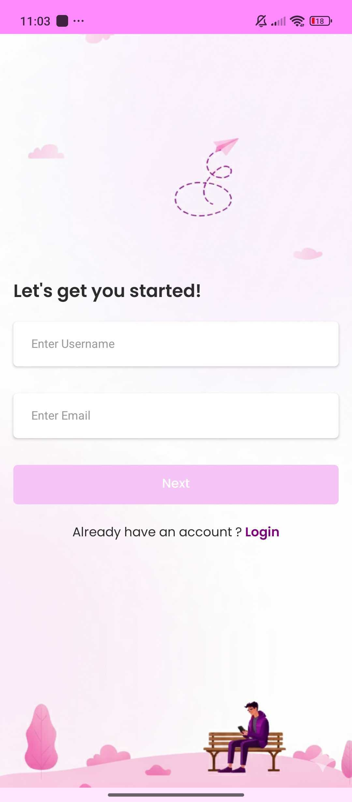
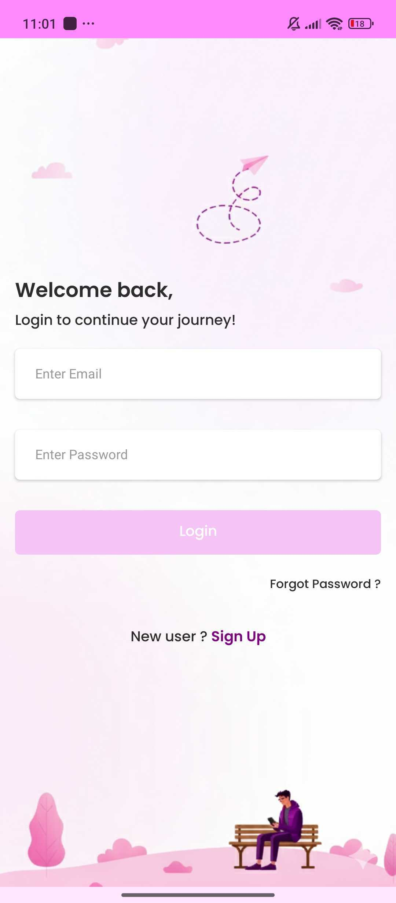
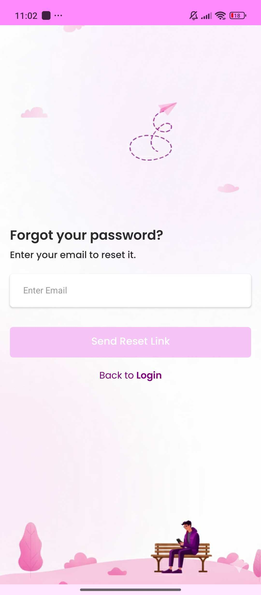
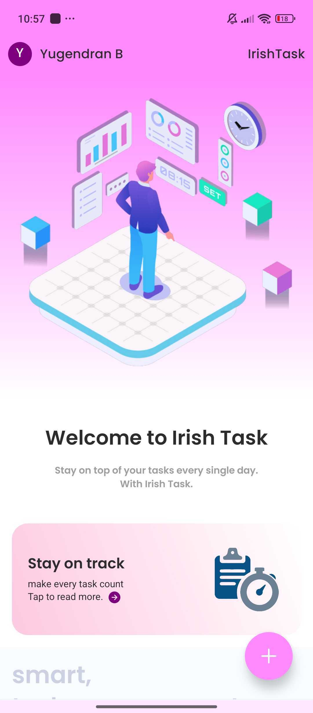
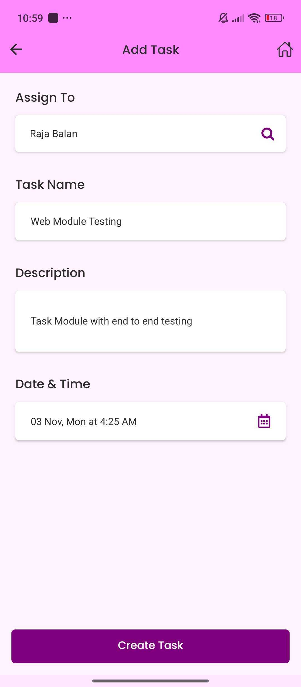
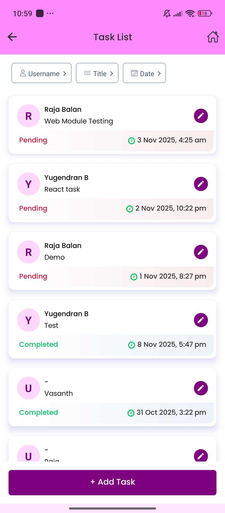
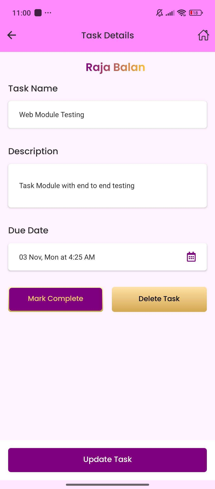
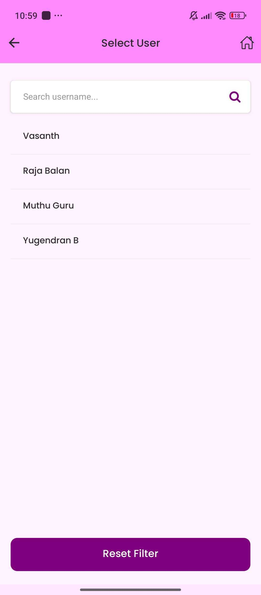
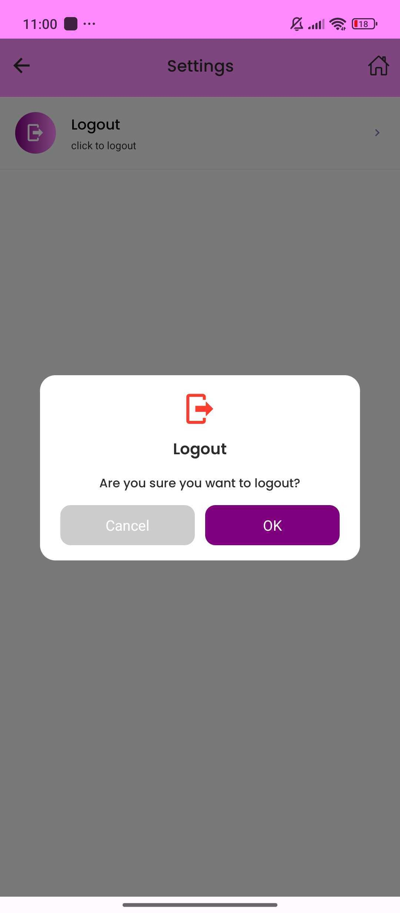

# 🧠 SmartTask Manager (SDE II Assessment)

A task management app built with **React Native**, featuring **Firebase Firestore integration**, **Redux Toolkit state management**, **Firebase Authentication**, and **local notifications**.  
Developed by **Yugendran B** as part of the **SDE II Project Assessment**.

---

## 🔐 Authentication System (Email & Password)

SmartTask Manager uses **Firebase Authentication** for secure login and user management.

### ✨ Features:
- **Create New Account:** Users can register using their email and password.
- **Login:** Existing users can sign in securely.
- **Forgot Password:** Sends a password reset link to the registered email. *(Note: The reset email may appear in the **Spam** folder.)*
- **Role-Based Access:**  
  - Admin access is determined by email:  
    **Admin:** `yugendran1407@gmail.com` (Password: `1234567890`)  
  - Other users are regular users with limited privileges.

---

## ⚙️ Features Implemented

- **Task Management (CRUD):**
  - Create, read, update, and delete tasks.
  - Each task includes:  
    `id`, `title`, `description`, `completed`, `notified`, `dueDate`, `createdAt`, `updatedAt`, and `userId`.
  - Real-time updates with **Firebase Firestore**.
  - Tasks can be marked as **complete/incomplete**.

- **User Management:**
  - A `users` collection stores user details (`user_id`, `username`, `email`).
  - Each task is linked to a user using `user_id`.
  - Tasks can be filtered by username.

- **Role-Based Access Control:**
  - 👑 **Admin (yugendran1407@gmail.com)** can:
    - Create, update, delete, and view all user tasks.
    - Filter tasks by **Username**, **Title**, and **Date**.
  - 🙋 **Regular Users** can:
    - View and update only their own tasks.
    - Mark tasks as **Complete** or **Incomplete**.
    - Filter tasks only by **Title** and **Date**.

- **Local Notifications:**
  - Implemented with **Notifee** to notify users when:
    - A task is **due** or **overdue**.
    - A task is **completed**, showing:  
      `"✅ Task Completed! You’ve completed the task “<title>”. Great job!"`
  - Notifications are **local** — each user only receives notifications for their own tasks.

---

## 🧠 Tech Stack Used

- **Frontend:** React Native (CLI)
- **Backend:** Firebase Firestore
- **Authentication:** Firebase Auth (Email/Password)
- **State Management:** Redux Toolkit
- **Storage:** AsyncStorage (for caching)
- **Notifications:** Notifee

---

## 🗂️ Firestore Collections

### `users`
| Field | Type | Description |
|-------|------|-------------|
| `user_id` | string | Unique user ID |
| `username` | string | Display name |
| `email` | string | Registered email |

### `tasks`
| Field | Type | Description |
|-------|------|-------------|
| `id` | string | Task ID |
| `title` | string | Task title |
| `description` | string | Task description |
| `completed` | boolean | Task completion status |
| `notified` | boolean | If local notification was sent |
| `dueDate` | timestamp | Task due date |
| `userId` | string | Linked user ID |
| `createdAt` | timestamp | Task creation time |
| `updatedAt` | timestamp | Last update time |

---

## 🧰 State Management

Handled via **Redux Toolkit**:
- Centralized store for tasks and users.
- Async actions handle Firebase CRUD.
- Local caching via **AsyncStorage**.

---

## 🪫 Offline Sync Strategy
*(Not yet implemented)*  
Uses Firestore’s real-time updates for now.  
Planned enhancement: **offline caching** and **sync on reconnect**.

---

## 📸 App Screenshots

| | |
|:--:|:--:|
|  |  |
|  |  |
|  |  |
|  |  |
|  |  |

---

## 🤖 AI Usage Disclosure

> Used **ChatGPT (OpenAI GPT-5)** to assist with Firebase Auth logic, CRUD structure, notification flow, and documentation formatting.

---

## 📱 How to Run the App

```bash
# 1. Install dependencies
npm install

# 2. Run on Android
npx react-native run-android

# or for iOS
npx react-native run-ios
